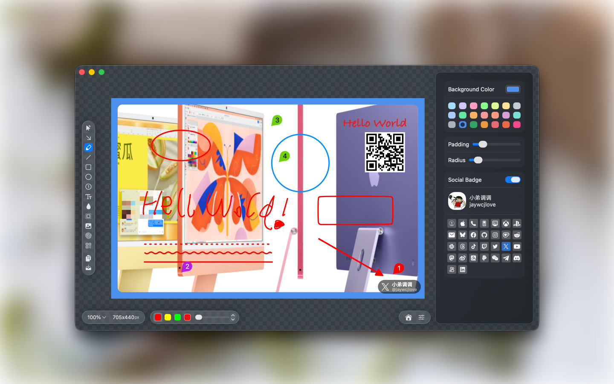
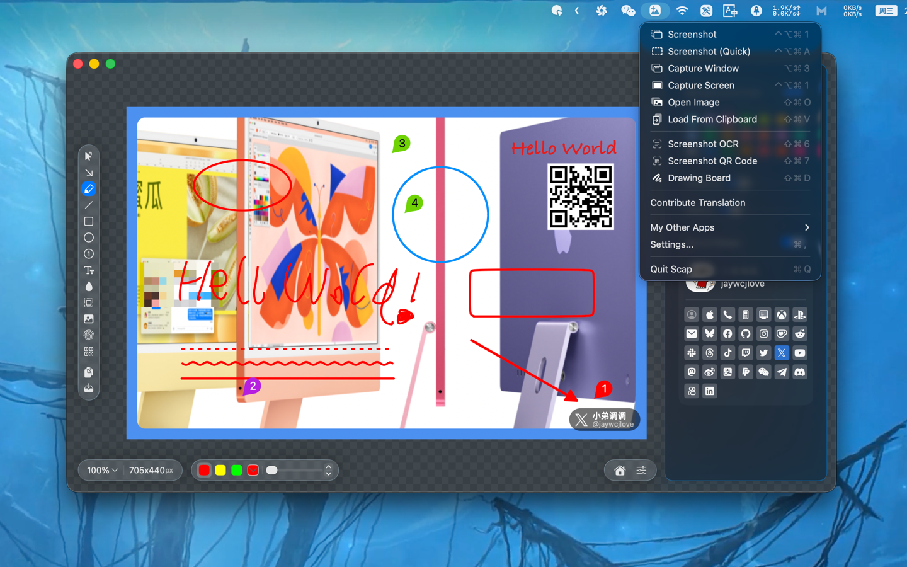

<!--idoc:ignore:start-->
> [!TIP]
> Declaration: This project is not an open-source project. The repository serves as the official website, used to collect issues and user demands. This is done to save costs, because without an official website, the application cannot pass the review.
<!--idoc:ignore:end-->

   
   
  
  <h1>
    Scap
  </h1>
  <!--rehype:style=border: 0;-->
  

    
    
    
  

  

    <a href="./README.zh.md">简体中文</a> • 
    <a target="_blank" href="https://github.com/jaywcjlove/scap/issues/new?template=bug_report.yml">Contact & Support</a> • 
    <a href="./CHANGELOG.md">Changelog</a>
  

  

    
  

Scap is a macOS app designed specifically for image screenshotting, annotation, and canvas creation. It provides a focused editing canvas integrated with powerful tools, including drawing tools, blur/mosaic, spotlight, QR code overlay, watermark, image layer paste functions, screenshot OCR, and QR code recognition. In addition to robust editing capabilities, Scap supports editable OCR text results, editing existing images, a free drawing board mode, a precise screenshot mode, and a localized interface in Simplified Chinese, Traditional Chinese, English, German, French, Japanese, and Korean, helping users efficiently complete image processing tasks.

## Features

- **Screenshots:** Area capture mode with crosshair guidance, plus OCR and QR code recognition for captured content.
- **Edit Mode:** Annotation workflow designed for photos and screenshots.
- **Drawing Board Mode:** A blank canvas for freeform creation.
- **Toolbox:** Crop/selection, arrow, freehand brush, line (solid/dashed), rectangle, ellipse, counter marks, blur/mosaic, spotlight, QR code, watermark, and pasted image layers.
- **OCR Results:** Recognized text remains editable for quick cleanup and reuse.
- **Image Overlay:** Paste images with auto-scaling to fit the canvas.
- **Export & Sharing:** Export or copy to clipboard with precise DPI handling.
- **Localization:** Supports Simplified Chinese, Traditional Chinese, English, German, French, Japanese, and Korean.
- **Social Badge:** Optional social platform corner badge (icon + name/handle).

## Modes

* `Edit`: Annotate a specific image.
* `DrawingBoard`: Free drawing canvas.
* `ScreenCrop`: Select and capture a screen region.

## Shortcuts (Tools)

* `V`: Crop / Select
* `A`: Arrow
* `T`: 文本
* `D`: Free Brush
* `L`: Line
* `R`: Rectangle
* `O`: Ellipse
* `C`: Number Marker
* `B`: Blur / Mosaic
* `S`: Spotlight
* `W`: Watermark
* `Q`: QR Code
* `⌘V`: Paste Image
