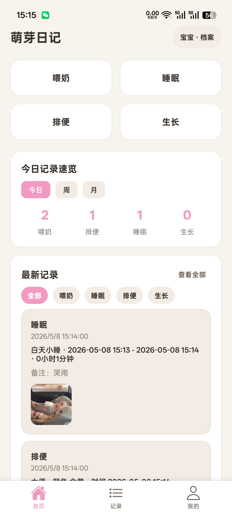
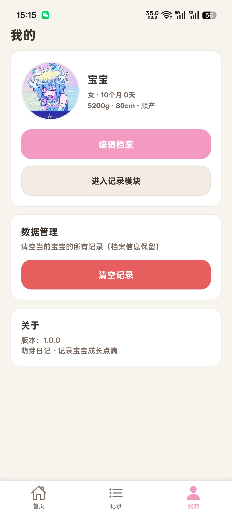

<!--idoc:ignore:start-->
> [!TIP]
> 声明：此项目并非开源项目，仓库作为官方网站，用于收集问题和用户需求。这样做是为了节省成本，因为没有官网，应用无法通过审核。
<!--idoc:ignore:end-->

<!-- 
 -->
   
   
  
  <h1>
    萌芽日记
  </h1>
  <!--rehype:style=border: 0;-->
  

    
    
    
  

  

    <a href="./README.md">English</a> • 
    <a target="_blank" href="https://github.com/hy916/scap/issues/new?template=bug_report_cn.yml">联系&支持</a> • 
    <a href="./CHANGELOG.zh.md">更新日志</a>
  

萌芽日记APP用途在于新手父母在宝宝出生后，需记录大量基础信息、喂养细节、日常状态及生长发育情况，当前多通过纸质笔记、备忘录等方式记录，存在信息零散、查找不便、统计困难、无法直观追踪成长趋势等问题。本APP旨在整合宝宝出生至成长各阶段的核心记录需求，提供便捷、全面、直观的记录工具，帮助父母系统化留存宝宝成长痕迹，同时为宝宝体检、就医提供精准的历史数据支撑，减轻育儿记录负担。

## 功能特性

**喂养记录**  
 
记录母乳、配方奶、辅食、饮水量，自动统计喂养间隔，支持夜奶专项记录。 

**日常日志**  
 
便捷记录尿布状态、睡眠时段、哭闹情况及日常护理各类事项。 
 
**健康监测**  
 
追踪体温变化、皮肤状况、每日健康状态，可添加备注详细记录。 
 
**成长时间线**  
 
长期记录体重、身长 / 身高、头围，留存宝宝发育里程碑事件。 
 
**智能提醒**  
 
自定义疫苗接种、儿保体检、成长录入、日常护理等事项提醒。 
  
**数据管理**  
   
支持数据备份、导出与记录管理，安全长久留存育儿所有数据。 